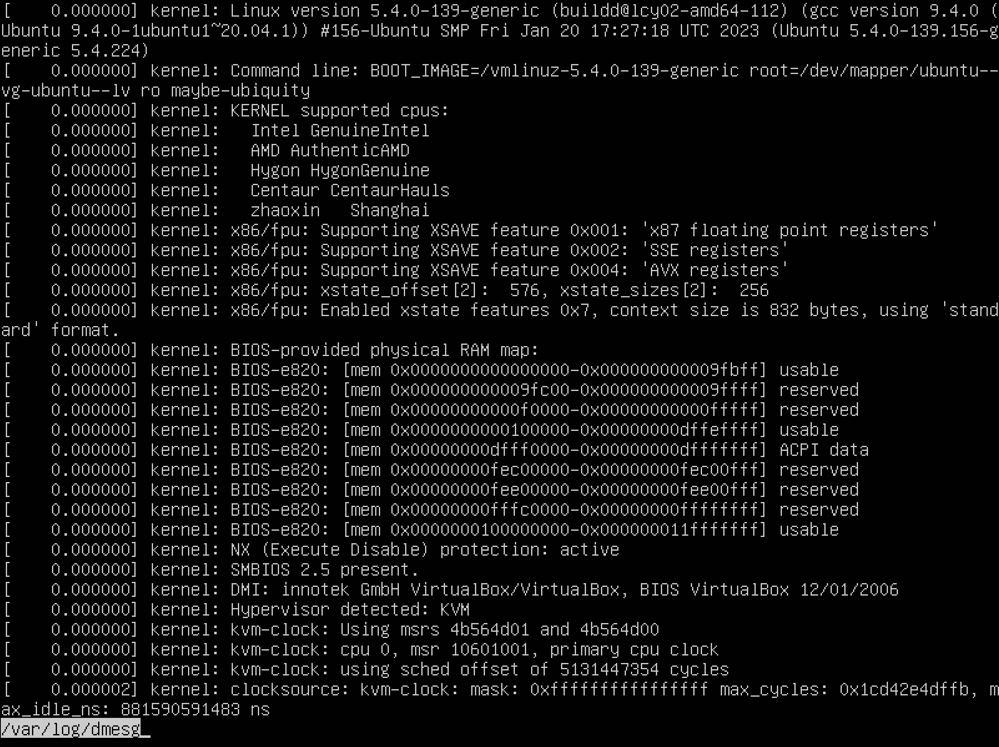

## Part 1. Installation of the OS

`-` **Ubuntu 20.04 Server LTS** was installed using VirtualBox. I spent a few day to find how to make it, becouse there was some issues with memory on school Mac (You know what I mean), but I made it.😁 \
Using command `cat /etc/issue` to see the version of installed Ubuntu server. \
**ScreenShot_1-1.png**

## Part 2. Creating a user

`-` Created the new user using command `sudo adduser user-2`. Then added the new user to group **adm** using command `sudo usermod -aG adm user-2`. \
**ScreenShot_2-1.png**

`-` Checked the existence of the new user using command `cat /etc/passwd`. \
**ScreenShot_2-2.png**

## Part 3. Setting up the OS network

`-` To change the machine name need to use this command `sudo hostnamectl set-hostname user-1`. To verify that the new hostname was seted correctly use command `hostnamectl`. To apply the new hostname use command `exec bash` or reboot the system. \
**ScreenShot_3-1.png**

`-` To see the list of timezones using command `timedatectl list-timezones`. Using command `sudo timedatectl set-timezone Europe/Moscow`. To verify that timezone has been set use command `timedatectl`. \
**ScreenShot_3-2.png**

`-` To output the names of the network interfaces using a console command `ip link show`. \
**ScreenShot_3-3.png**

The `lo` interface, also known as the loopback interface, is a virtual network interface that is automatically created on every Linux system, including Ubuntu Server LTS 20.04.5.

The purpose of the `lo` interface is to provide a mechanism for a device to communicate with itself. When a program on the system sends network traffic to `localhost` or `127.0.0.1`, the traffic is sent to the `lo` interface, which then routes the traffic back to the same device. This allows a program on the system to communicate with other programs or services running on the same device, without the need for an actual physical network connection.

The `lo` interface is always present and active, and it has the IP address `127.0.0.1`. It is a critical part of the networking stack on Linux, and it is used by many system services and applications, such as web servers, databases, and email servers.

\
`-` To get the ip address of the device from the DHCP server use console command `ip address show`. \
**ScreenShot_3-4.png**

DHCP stands for Dynamic Host Configuration Protocol. It is a network protocol that enables network devices, such as computers, servers, and routers, to automatically obtain an IP address and other network configuration parameters, such as subnet mask, default gateway, and DNS server addresses, from a DHCP server.

When a device connects to a network, it sends a broadcast message called a DHCP Discover message. The DHCP server on the network receives this message and responds with a DHCP Offer message that includes an available IP address and other configuration parameters.

The device then sends a DHCP Request message to accept the offer, and the DHCP server responds with a DHCP Acknowledge message that confirms the assignment of the IP address and other network parameters.

DHCP is widely used in modern computer networks, as it simplifies the process of network configuration and management. It allows network administrators to easily assign and manage IP addresses for devices on the network, and ensures that IP addresses are not duplicated, which can cause network conflicts.

\
`-` To display the external IP address of the gateway, you can use the following command `curl ifconfig.me`. To display the internal IP address of the gateway, also known as the default IP address or gateway IP address, you can use the following command `ip route | awk '/default/ {print $3}'`. \
**ScreenShot_3-5.png**

`-` To set a static IP address, gateway, and DNS server need to edit the netplan configuration file `/etc/netplan/00-installer-config.yaml` using command `sudo nano /etc/netplan/00-installer-config.yaml`. Change the dhcp4 option to false, and add the following lines to set the static IP address, gateway, and DNS server: \

`renderer: networkd` \
`  ethernets:` \
`    enp0s3:` \
`      addresses: [10.0.2.15/24]` \
`      gateway4: 10.0.2.2` \
`      nameservers:` \
`        addresses: [1.1.1.1, 8.8.8.8]` \

Apply the changes by running the following command `sudo netplan apply`. \
**ScreenShot_3-6.png**

`-` To ping 1.1.1.1 and ya.ru remote hosts use commands `ping -c 5 1.1.1.1` and `ping -c 5 ya.ru`. \
**ScreenShot_3-7.png**

## Part 4. OS Update

`-` To update using commands `sudo apt-get update` and `sudo apt-get upgrade`. \
**ScreenShot_4-1.png**

## Part 5. Using the **sudo** command

`-` To allow created user to execute sudo command use command `sudo adduser user-2 sudo`. \
**ScreenShot_5-1.png**

`-` **The true purpose of sudo command.** \
**sudo** (`/suːduː/` or `/ˈsuːdoʊ/`) is a program for Unix-like computer operating systems that enables users to run programs with the security privileges of another user, by default the superuser. It originally stood for "superuser do", as that was all it did, and it is its most common usage; however, the official Sudo project page lists it as "su 'do' ". The current Linux manual pages for su define it as "substitute user", making the correct meaning of sudo "substitute user, do", because sudo can run a command as other users as well.

Unlike the similar command su, users must, by default, supply their own password for authentication, rather than the password of the target user. After authentication, and if the configuration file (typically `/etc/sudoers`) permits the user access, the system invokes the requested command. The configuration file offers detailed access permissions, including enabling commands only from the invoking terminal; requiring a password per user or group; requiring re-entry of a password every time or never requiring a password at all for a particular command line. It can also be configured to permit passing arguments or multiple commands.

`-` To change the hostname need to use this command `sudo hostnamectl set-hostname coffeeta`, sameone that was on **Part 2**. To verify that the new hostname was seted correctly use command `hostnamectl`. To apply the new hostname use command `exec bash` or reboot the system. \
**ScreenShot_5-2.png**

## Part 6. Installing and configuring the time service

`-` To set up the automatic time synchronisation service use command `timedatectl set-ntp on`. I don't know why they asked me to make a few screenshots, but I made only 1, all of them fited in 1. \
**ScreenShot_6-1.png**

## Part 7. Installing and using text editors

`-` I choosed text editors **VIM**, **NANO** and **JOE**, and created files `text_joe.txt`, `text_vim.txt` and `text_nano.txt`. \
**ScreenShot_7-1.png**

To save and exit **VIM** use to save `:w`, after to exit `:q`. \
**ScreenShot_VIM-1.png**

**`  ^    is   Ctrl  `** \
To save and exit **NANO** use to save `^ + O + Enter`, after to exit `^ + X`. \
**ScreenShot_NANO-1.png**

**`  ^    is   Ctrl  `** \
To save and exit **JOE** use `^ + K + X`.
**ScreenShot_JOE-1.png**

`-` Changing and exiting files without saving.

To exit without saving **VIM** use `:q!`.\
**ScreenShot_VIM-2.png**

**`  ^    is   Ctrl  `** \
To exit without saving **NANO** use `^ + X` after `N`. \
**ScreenShot_NANO-2.png**

**`  ^    is   Ctrl  `** \
To exit without saving **JOE** use `^ + K + Q` after `N`.
**ScreenShot_JOE-2.png**

`-` The functions of searching through the contents of a file (a word) and replacing a word with any other one.

To search through the contents of a file (a word) in VIM use `/example` once you press enter vim will highlight first occurrence of `example`. \
To search through the contents of a file (a word) and replace a word with any other one in VIM use `:%s/find/replace/g`, this function will replace all the occurrence of `find`, if you want to replace only first occurrence you must you without `%` like this `:s/find/replace/g`. \
**ScreenShot_VIM-3.png** \
**ScreenShot_VIM-3-1.png**

**`  ^    is   Ctrl  `** \
To search through the contents of a file (a word) in NANO press the `^ + W` keys to open the search function. Type in the text you want to search for and press Enter. If the text is found, nano will move the cursor to the first occurrence of the text. Press the `^ + W` keys again to search for the next occurrence of the text. \
To search through the contents of a file (a word) and replace a word with any other one in NANO press `^ + W` w to activate the search function. Type the word you want to find and press Enter. Press `^ + \` to activate the replace function. Type the word you want to replace the found word with and press Enter. Press `Y` to replace the current instance of the found word. Press `A` to replace all instances of the found word. \
**ScreenShot_NANO-3.png** \
**ScreenShot_NANO-3-1.png**

**`  ^    is   Ctrl  `** \
To search through the contents of a file (a word) in JOE press `^ + K + F` keys at the same time to enter search mode. Type the text you want to search for and press Enter. Then press `I` to just find the text you want. Press the `L` key to go to the next instance. \
To search through the contents of a file (a word) and replace a word with any other one in JOE press `^ + K + F` keys at the same time to enter search mode. Type the text you want to search for and press Enter. Then press `R` to inter replace mode. Type the text you want to replace for and press Enter. Press `Y` to replace first occurrence or press `R` to replace all occurrences.\
**ScreenShot_JOE-3.png** \
**ScreenShot_JOE-3-1.png**

## Part 8. Installing and basic setup of the **SSHD** service

`-` To install **SSHs** service use command `sudo apt install openssh-server`. After installation **SSHd** service will start automatically. To verify use command `sudo sytemctl status ssh`. \
**ScreenShot_8-1.png**

If you want to start **SSHd** servisce manually use command `sudo systemctl start ssh`. \
To enable the **SSHd** service to start automatically at boot time, use command `sudo systemctl enable ssh`. \
**ScreenShot_8-2.png**

To reset **SSHd** service to port 2022 need to edit file `/etc/ssh/sshd_config` using command `sudo nano /etc/ssh/sshd_config` (I am using NANO text editor, you can use any other one). Find the line like `#Port 22`, uncomment removing `#` and change `22` to `2022`. Save changes and restart **SSHd** service using command `sudo systemctl restart ssh`. To verify use command `sudo sytemctl status ssh`. \
**ScreenShot_8-3.png**

To show the presence of the sshd process use command `ps aux | grep sshd`. \

`ps`: This command is used to report a snapshot of the current processes running on the system. \
`aux`: This option tells `ps` to show a detailed list of all processes, including those not associated with a terminal (or background processes) and their status information. Specifically, it stands for: \
`a`: Show processes for all users, not just the current user. \
`u`: Display the user-oriented format. This includes the user who started the process, the start time of the process, and the CPU and memory usage of the process. \
`x`: Show processes that are not attached to a terminal (e.g. daemons). \
`|`: This is a pipe operator that redirects the output of the `ps` command to the input of the `grep` command. \
`grep`: This command is used to search for a specific pattern in the output of another command. \
`sshd`: This is the search pattern used by `grep` to find the line that includes `sshd` in the output of the ps command. If there is a running process with `sshd` in its name, it will be displayed. \

The command `ps aux | grep sshd` is used to show a list of all processes running on the system and search for any that have `sshd` in their name. This allows us to check if the **SSHd** server process is currently running on the system. \
**ScreenShot_8-4.png**

`-` The `netstat` command is a utility that displays information about the network connections on a system. The `-tan` flags specify options to show all TCP connections and their numerical addresses (IP addresses and port numbers) in a numeric format, rather than resolving them to domain names and service names.\

`-t`: This option shows all TCP connections.\
`-a`: This option shows both listening and non-listening (established) connections.\
`-n`: This option shows numerical addresses (IP addresses and port numbers) rather than resolving them to domain names and service names.\

Each column in the output has the following meaning:\

`Proto`: The protocol used for the connection (e.g., TCP or UDP).\
`Recv-Q`: The amount of data received and waiting to be processed in bytes.\
`Send-Q`: The amount of data waiting to be sent in bytes.\
`Local Address`: The IP address and port number of the local endpoint of the connection.\
`Foreign Address`: The IP address and port number of the remote endpoint of the connection.\
`State`: The current state of the connection (e.g., `LISTEN`, `ESTABLISHED`, `TIME_WAIT`, etc).\

The value of `0.0.0.0` in the `Local Address` column indicates that the connection is listening on all available network interfaces (i.e., all IP addresses assigned to the system) and all available ports. This is known as a wildcard address, and it means that the connection is accepting incoming connections from any IP address. In the **ScreenShot_8-5.png**, the SSH server is listening on all available network interfaces on port 2022.\
**ScreenShot_8-5.png**

## Part 9. Installing and using the **top**, **htop** utilities

`-` To install the **top**, **htop** utilities use command `sudo apt-get install top htop`.

The output of the top command determine: \
uptime: 23 min \
number of authorised users: 1 user \
total system load: 0.00, 0.01, 0.00 \
total number of processes: 103 \
cpu load: 0.0 us \
memory load: 9.7/3931.8 \
pid of the process with the highest memory usage: 687 \
pid of the process taking the most CPU time: all of them: 1628 \
**ScreenShot_9-1.png**

Screenshots of the htop command output: \
**ScreenShot_9-2.png** \
**ScreenShot_9-3.png** \
**ScreenShot_9-4.png** \
**ScreenShot_9-5.png** \
**ScreenShot_9-6.png** \
**ScreenShot_9-7.png** \
**ScreenShot_9-8.png** \
**ScreenShot_9-9.png** 

## Part 10. Using the **fdisk** utility

The name of the hard disk `VBOX HARDDISK`. \
Capacity `20.45 GiB`. \
Number of sectors `42872832`. \
The swap size `21950889984 bytes`. \
**ScreenShot_10.png** 

## Part 11. Using the **df** utility

`-` Runing `df` command for the root partition (/): 

partition size: `10218772` \
space used: `2739968` \
space free: `6938132` \
percentage used: `%29` 

The unit of measurement used for the partition size, space used, and space free is typically displayed in bytes. However, `df` will automatically choose the most appropriate unit for each value and display it accordingly. For example, the `Size` column may display values in gigabytes (GB) or terabytes (TB) depending on the size of the partition. \
The `%Use` column shows the percentage of the partition that is currently being used. \
**ScreenShot_11-1.png**

`-` Runing the df -Th command for the root partition (/): 

partition size: `9.8G` \
space used: `2.7G` \
space free: `6.7G` \
percentage used: `%29` 

The unit of measurement used for the partition size, space used, and space free is typically displayed in bytes. However, `df` will automatically choose the most appropriate unit for each value and display it accordingly. For example, the `Size` column may display values in gigabytes (GB) or terabytes (TB) depending on the size of the partition. \
The file system type for the root partition will be listed in the `Type` column. Common file system types for Linux include ext2, ext3, ext4, and btrfs. \
**ScreenShot_11-2.png**

## Part 12. Using the **du** utility

`-` Runing the `du` command. \
**ScreenShot_12-1.png**

`-` Output the size of the /home, /var, /var/log folders (in bytes, in human readable format). \
**ScreenShot_12-2.png**

`-` Output the size of all contents in /var/log (not the total, but each nested element using *). \
**ScreenShot_12-3.png**

## Part 13. Installing and using the **ncdu** utility

`-` Installing `ncdu` utility using command `sudo apt-get install ncdu`. \
**ScreenShot_13-1.png**

`-` Outputing the size of the /home, /var, /var/log folders. \
**ScreenShot_13-2.png**\
**ScreenShot_13-3.png**\
**ScreenShot_13-4.png**

## Part 14. Working with system logs

`-` To view the contents of the files `/var/log/dmesg`, `/var/log/syslog`, and `/var/log/auth.log` you can use the `less` command. Commands `sudo less /var/log/dmesg`, `sudo less /var/log/syslog`, and `sudo less /var/log/auth.log`. \
**ScreenShot_14-1.png**\
**ScreenShot_14-2.png**\
**ScreenShot_14-3.png**

`-` To find the last successful login time, user name, and login method: \
In the auth.log file, search for the phrase "session opened for user" using the command: \
`sudo grep "session opened for user" /var/log/auth.log` \
**ScreenShot_14-4.png**

`-` To restart the SSHd service, runing the command `sudo service ssh restart`. \
To view the restart message in the logs, using the journalctl command `sudo journalctl -u ssh` or using command `sudo grep "sshd.*Restarting" /var/log/auth.log`. \
**ScreenShot_14-5.png**\
**ScreenShot_14-6.png**

## Part 15. Using the **CRON** job scheduler

`-` To create a cron job that runs the uptime command every 2 minutes, following these steps: \

To open the crontab editor by running the command `crontab -e` in the terminal. \
Adding the following line to the crontab file `*/2 * * * * /usr/bin/uptime >> /var/log/uptime.log`. \
This line will run the uptime command every 2 minutes, and append the output to the file `/var/log/uptime.log`. \
**ScreenShot_15-1.png**

`-` To find the log lines about the execution, runing the command `sudo grep CRON /var/log/syslog`. \
This command will display the lines containing the word **CRON** in the syslog file, which includes the cron job execution logs. \
**ScreenShot_15-2.png**

`-` To display a list of current jobs for **CRON**, runing the command `crontab -l`. \
**ScreenShot_15-3.png**

`-` To remove all tasks from the job scheduler, runing the command `crontab -r`. \
To verify runing command `crontab -l`. \
**ScreenShot_15-4.png**

